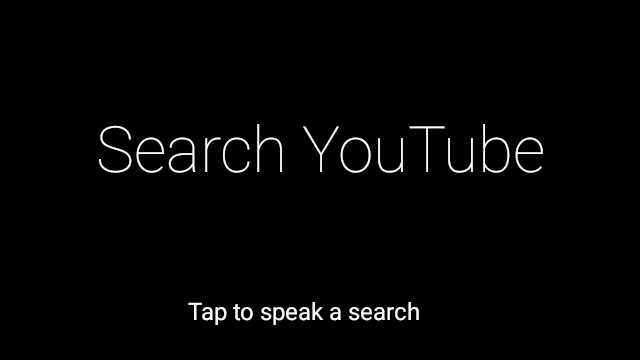
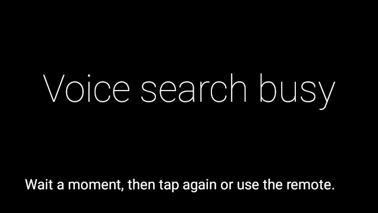
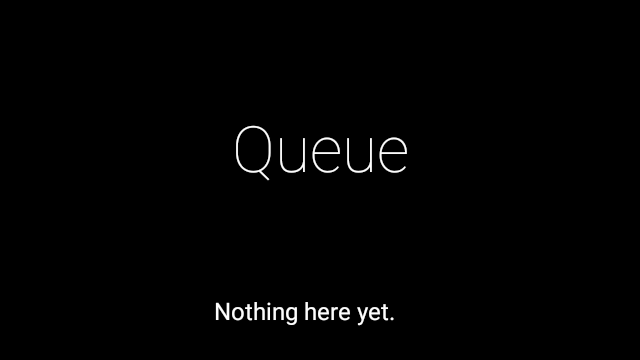
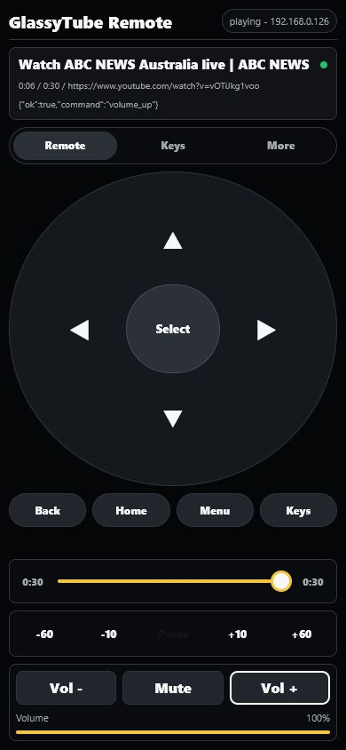
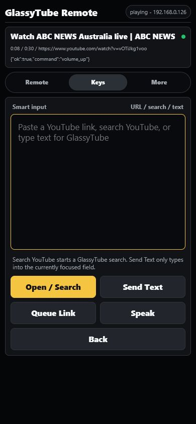
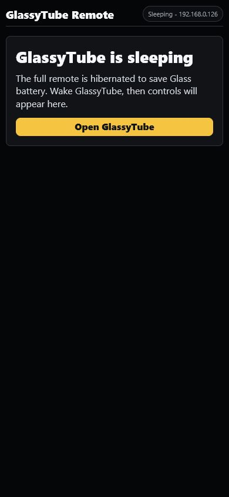

# GlassyTube

YouTube playback, search, link sharing, and a LAN remote for Google Glass.

GlassyTube is an extended build of [CatotheCat11/GlassTube](https://github.com/CatotheCat11/GlassTube). The original project provides the core Google Glass YouTube client; this repository adds XE24 stability work, a phone remote, queue/history/favorites, live-stream fixes, and battery-conscious remote behavior.

This is not an official Google, YouTube, Cast, or Glass product.

## Attribution

Base project:

- **GlassTube** by **CatotheCat11**
- Upstream: [github.com/CatotheCat11/GlassTube](https://github.com/CatotheCat11/GlassTube)

Additional work in GlassyTube:

- Google Glass Explorer Edition / XE24 testing
- GlassyTube Remote on port `8765`
- Phone/PWA link sending and queueing
- Remote media, timeline, volume, keyboard, and navigation controls
- History, favorites, and queue
- Live-stream/HLS audio handling improvements
- Playback lifecycle and battery cleanup

## Screenshots

| Glass home | Voice/search status | Queue |
| --- | --- | --- |
|  |  |  |

| Remote active | Remote keyboard | Remote sleeping |
| --- | --- | --- |
|  |  |  |

## Features

- Glass voice entry using the supported `FIND_A_VIDEO` command.
- Native Glass cards for search, recent videos, favorites, queue, and setup.
- YouTube video, playlist, channel, and shared-link handling.
- ExoPlayer playback with Glass-friendly stream selection.
- Tap, swipe, two-finger scrub, captions toggle, favorite, exit, and volume gestures.
- Phone/desktop remote at `http://<glass-ip>:8765/remote`.
- Remote wake, open URL, queue URL, play/pause, seek, scrub, volume, text, and basic key controls.
- Remote sleeps/hibernates when GlassyTube is not active to reduce battery use.

## Modules

- `app` - main GlassyTube app for Glass UI, search, playback, history, favorites, and queue.
- `remoteagent` - GlassyTube Remote web server and control bridge.

## Build

Requirements:

- Android Studio or Android SDK
- JDK 21
- ADB
- Google Glass with developer/debugging enabled
- `minSdk 19` for XE24 / Android 4.4.4

Build debug APKs:

```powershell
$env:JAVA_HOME='C:\Program Files\Android\Android Studio\jbr'
$env:ANDROID_HOME="$env:LOCALAPPDATA\Android\Sdk"
$env:ANDROID_SDK_ROOT=$env:ANDROID_HOME
$env:PATH="$env:JAVA_HOME\bin;$env:ANDROID_HOME\platform-tools;$env:PATH"

.\gradlew.bat :app:assembleDebug :remoteagent:assembleDebug
```

Install:

```powershell
adb install -r app\build\outputs\apk\debug\app-debug.apk
adb install -r remoteagent\build\outputs\apk\debug\remoteagent-debug.apk
adb shell am start -n com.glass.remoteagent/.MainActivity
```

Open the remote from a phone or computer on the same network:

```text
http://<glass-ip>:8765/remote
```

For USB testing:

```powershell
adb forward tcp:8765 tcp:8765
```

Then open:

```text
http://127.0.0.1:8765/remote
```

## Security

GlassyTube Remote is intended for trusted LAN or personal-hotspot use only.

- State-changing remote endpoints require a pairing token.
- `/status` is read-only.
- The remote uses plain HTTP for compatibility with Glass XE24 / Android 4.4.4.
- Do not expose port `8765` to the public internet.

## Known Limitations

- Official YouTube Cast-button receiver support is not implemented.
- The supported "cast-like" workflow is sending links to GlassyTube over LAN.
- YouTube extraction can break when YouTube changes behavior.
- Some videos may fail because of region, age, DRM, live-stream format, or extractor limits.
- ADB screenshots can show black frames for hardware video surfaces on old Android.

## Credits

- [CatotheCat11/GlassTube](https://github.com/CatotheCat11/GlassTube) for the original GlassTube project.
- CatotheCat11/OpenPrism for Glass compatibility support used by the base app.
- NewPipeExtractor for YouTube extraction.
- ExoPlayer for playback.
- NanoHTTPD for the embedded remote server.
